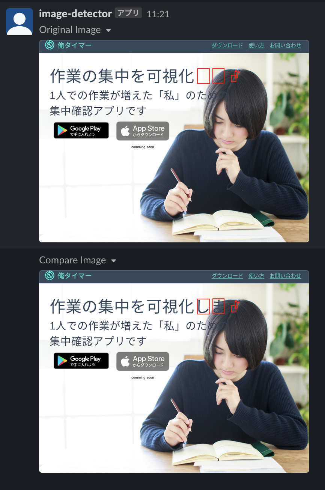

# image-regression-notification

## description

This action test the image regression between the two specified URLs(`BASE_URL`, `COMPARE_URL`) and report testing image to slack.

## demo
Here are the results of a sample workflow(`./github/workflows/sample.yml`)

The image differences is surrounded by a red rectangle.




## usage
```yaml
- uses: glassmonkey/image-regression-notification@v1.1
  with:
    BASE_URL: https://example.com
    COMPARE_URL: https://test.example.com
    SLACK_TOKEN: ${{ secrets.SLACK_TOKEN }}
    SLACK_CHANNEL: ${{ secrets.SLACK_CHANNEL }}
    ENABLE_SHOW_DIFF: false
```
